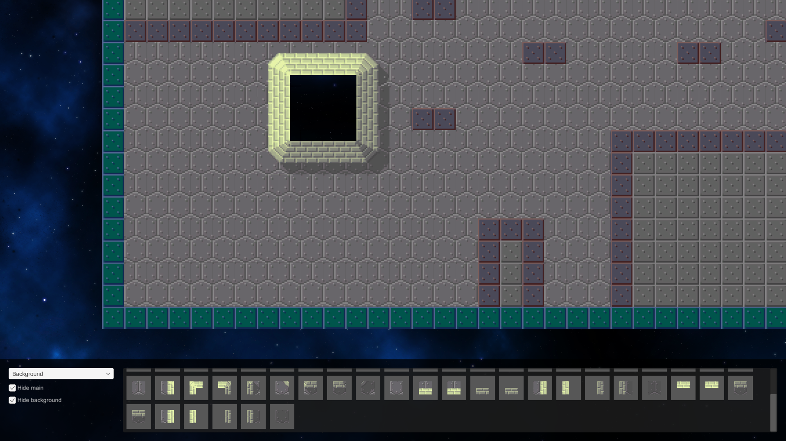

# This is a ball
Small Unity project to get to know the engine. Implemented features:
- A simple platformer gameplay:
   - Build-in basic physics (gravity, friction, bouncing) and a custom electric field component.
   - The player can switch between four different states: default, sticky, ice and metal (to interact with electric fields).
- A grid-base map system:
   - Handmade grid system with dynamic collisions
   - Map editor
- Visuals:
   - Handmade tilemap rendering
   - Parallax background
   - URP with 2D support (normal maps)
- Save/load system

## References
- Grid system: https://www.youtube.com/watch?v=waEsGu--9P8
- Tilemap rendering: https://www.youtube.com/watch?v=gD5EQyt7VPk
- Parallax background: https://www.youtube.com/watch?v=wBol2xzxCOU
- Save/load system: https://www.youtube.com/watch?v=6uMFEM-napE
